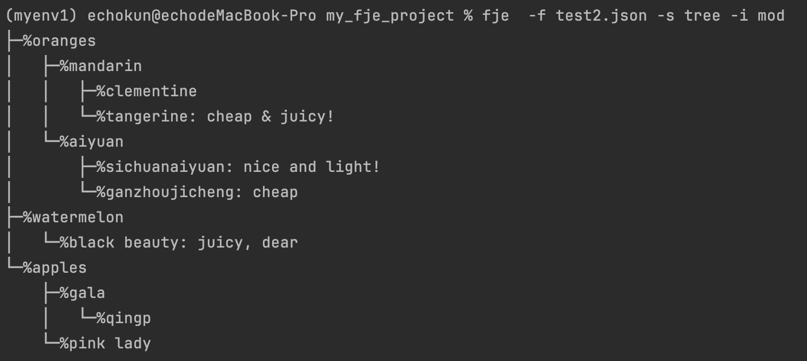

## 1. 配置环境

直接将项目clone之后，没法直接运行fje，但可以直接运行下列命令来测试代码正确性：

```shell
python main.py -f test2.json -s tree -i mod
```

为了能够在终端中，将 “python main.py” 替换为 “fje”需要进行配置。

下面我根据自身macos端的配置方法进行展示：

#### 第一步：创建文件并编辑

```
touch fje
nano fje
```

#### 第二步：添加内容

```
#!/bin/bash
python /Users/echokun/Py_Pycharm/software_engineering/my_project/main.py "$@"
```

第一行是注释，表示这是一个bash脚本；第二行是运行命令
第二行的符号
"$@": 这是一个特殊的变量，表示脚本接收到的所有参数。
"$@" 会将参数列表传递给 main.py 脚本，使其能够在执行过程中访问这些参数。
因此，当你运行这个脚本时，它将调用 Python 解释器执行 main.py 脚本，并将脚本接收到的所有参数传递给 main.py。

#### 第三步：保存并退出

```
Ctrl+O
Ctrl+X
```

#### 第四步：添加可执行权限

```
chmod +x fje
```

这样就可以直接在终端输入fje来运行了

#### 第五步：

```
sudo mv fje /usr/local/bin/
```

将文件 fje 移动到 /usr/local/bin/ 目录下。
这样做的目的可能是将文件 fje 放置在系统的可执行文件路径中，
使其可以在任何位置方便地执行，而不需要指定完整的文件路径。

## 2. 代码运行：

**示例1：**


**示例2:** (这里采用了我自己编写的更完整的json文件去测试)

 

**示例3:**

 

**示例4:**


```shell
 fje  -f test2.json -s rectangle -i poker  
```

​	其中 -f 后面接的是文件路径； -s 是指定风格（实现了tree_style 和 rect_style）； - i 指定icon_familiy（实现了* % ♤ 等）


## 3. 类图展示：

 

#### 1. 工厂模式： icon的实现是具体的产品；icon_family是它们的工厂。

#### 2. 抽象工厂模式：我们可以看到中间部分就使用了抽象工厂模式

- **抽象工厂接口 - StyleFactory**： 定义了一组创建方法，用于生成不同产品的抽象类型。
- **具体工厂类 - RectangleStyleFactory和TreeStyleFacotry**： 实现抽象工厂接口，提供具体产品的创建逻辑。
- **抽象产品接口 - style**： 定义产品的接口，各具体产品类必须实现这些接口。
- **具体产品类 - RectangleStyle 和 TreeStyle**： 实现抽象产品接口，表示具体产品。

#### 3. 组合模式： 其中TreeStyle的具体实现是运用了组合模式，通过区分复合节点composite和叶子结点leaf，二者共同实现了统一借口component。

#### 4. 建造者模式：RectangleStyle的实现使用了建造者模式，其中具体建造者只有一个实例